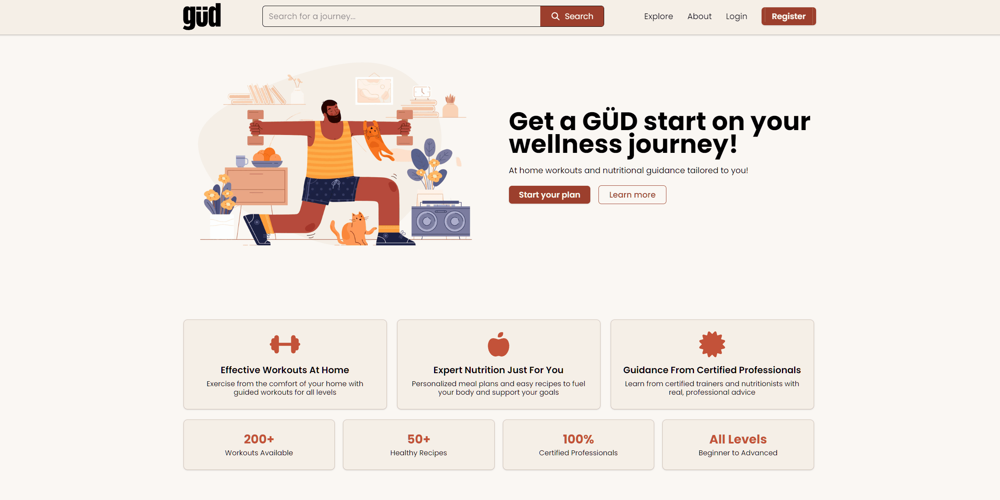

# GÜD — Fitness & Wellness Platform

GÜD is a community-driven fitness and wellness web app connecting certified trainers and nutritionists with users seeking guided at-home workouts and personalized nutrition content.



---

## Features

- **Video Library** — Browse and search fitness and nutrition videos uploaded by certified professionals
- **Explore Page** — Discover trainers, nutritionists, and featured content
- **User Profiles** — Customizable profiles with avatar uploads, bios, and linked video content
- **Professional Profiles** — Extended profiles for trainers/nutritionists with specialties, certifications, and social links
- **Authentication** — Email/password sign-up and login with session management
- **Search** — Find videos by title from the header search bar
- **Responsive UI** — Mobile-friendly navigation and layout

---

## Tech Stack

| Layer           | Technology                                                                                                       |
| --------------- | ---------------------------------------------------------------------------------------------------------------- |
| Framework       | [Next.js](https://nextjs.org/) (App Router)                                                                      |
| UI              | [Tailwind CSS](https://tailwindcss.com/), [FontAwesome](https://fontawesome.com/), [Motion](https://motion.dev/) |
| Auth & Database | [Supabase](https://supabase.com/) (PostgreSQL + Auth)                                                            |
| Media           | [AWS S3](https://aws.amazon.com/s3/) (file storage) + [AWS CloudFront](https://aws.amazon.com/cloudfront/) (CDN) |
| Deployment      | Docker / standalone Next.js output                                                                               |

---

## Vercel Site

Live Application  
[https://gud-fitness.vercel.app](https://gud-smoky.vercel.app/)

## Screenshots


## Getting Started

### Prerequisites

- Node.js 18+
- A [Supabase](https://supabase.com/) project
- An [AWS](https://aws.amazon.com/) account with S3 and CloudFront configured

### Installation

```bash
git clone https://github.com/Yousor0/gud-app.git
cd gud-app
npm install
```

### Environment Variables

Create a `.env.local` file in the root:

```env
NEXT_PUBLIC_SUPABASE_URL=your_supabase_project_url
NEXT_PUBLIC_SUPABASE_ANON_KEY=your_supabase_anon_key

AWS_ACCESS_KEY_ID=your_aws_access_key_id
AWS_SECRET_ACCESS_KEY=your_aws_secret_access_key
AWS_REGION=your_aws_region
AWS_S3_BUCKET_NAME=your_s3_bucket_name
NEXT_PUBLIC_CLOUDFRONT_URL=your_cloudfront_distribution_url
```

### Run Locally

```bash
npm run dev
```

Open [http://localhost:3000](http://localhost:3000).

---

## Project Structure

```
src/
├── app/                    # Next.js App Router pages
│   ├── (auth)/             # Login, register, user profiles
│   ├── (feed)/             # Explore and search pages
│   ├── media/[content]/    # Video detail page
│   └── api/                # API routes (AWS S3 uploads, account deletion)
├── components/             # Shared UI components
├── context/                # Auth context provider
├── features/               # Domain modules (auth, profiles, videos)
│   ├── auth/
│   ├── profiles/
│   └── videos/
└── lib/supabase/           # Supabase client setup
```

---

## Database Schema

| Table                   | Description                                       |
| ----------------------- | ------------------------------------------------- |
| `profiles`              | Core user info (username, avatar, bio, role)      |
| `professional_profiles` | Extended info for trainers/nutritionists          |
| `videos`                | Video metadata (title, type, thumbnail, uploader) |

---

## Deployment

The app supports Docker deployment:

```bash
docker-compose up --build
```

Or deploy to [Vercel](https://vercel.com/):

```bash
vercel deploy
```

---

## License

MIT
